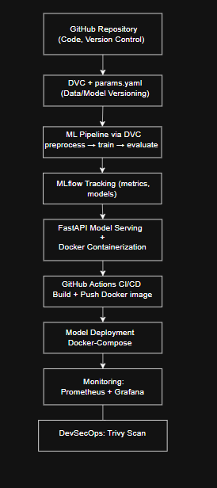
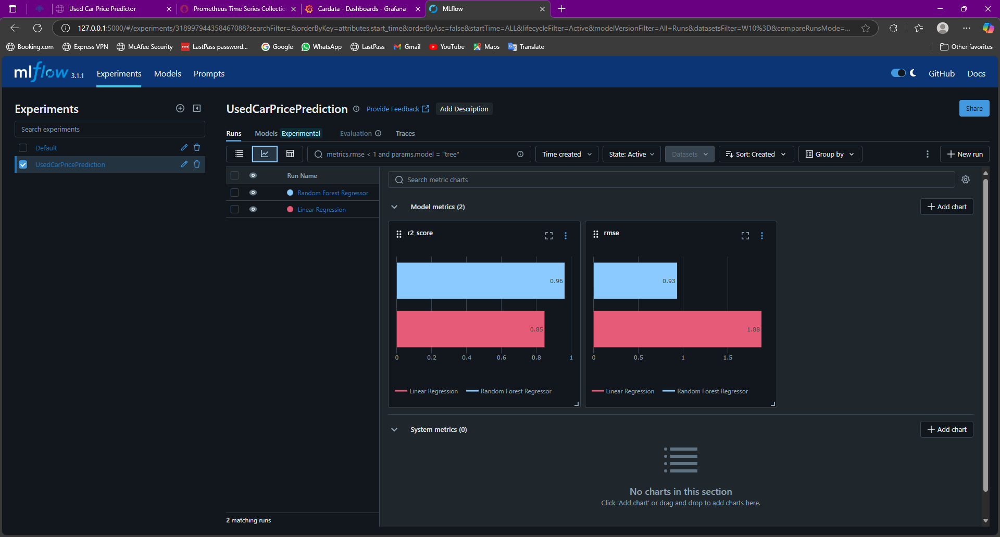
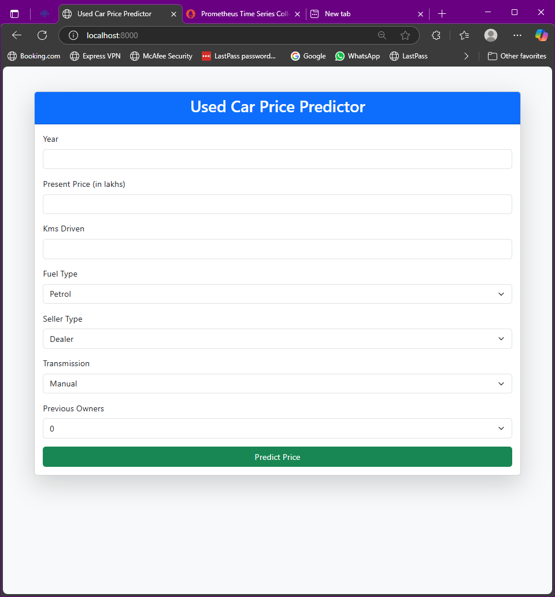
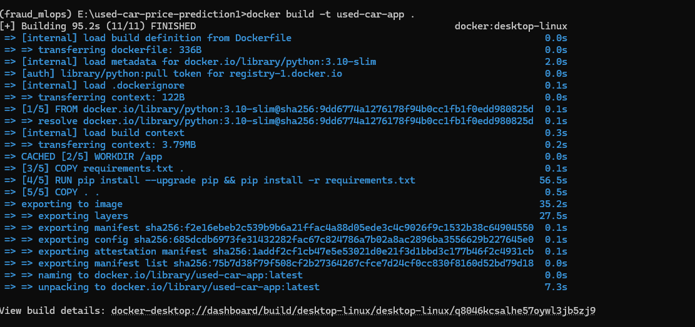
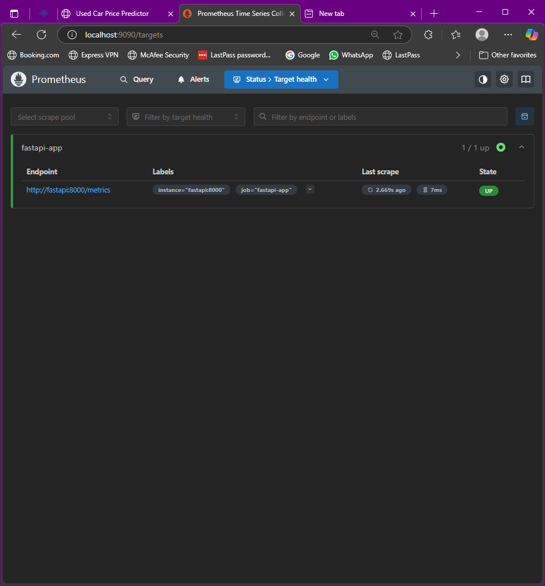
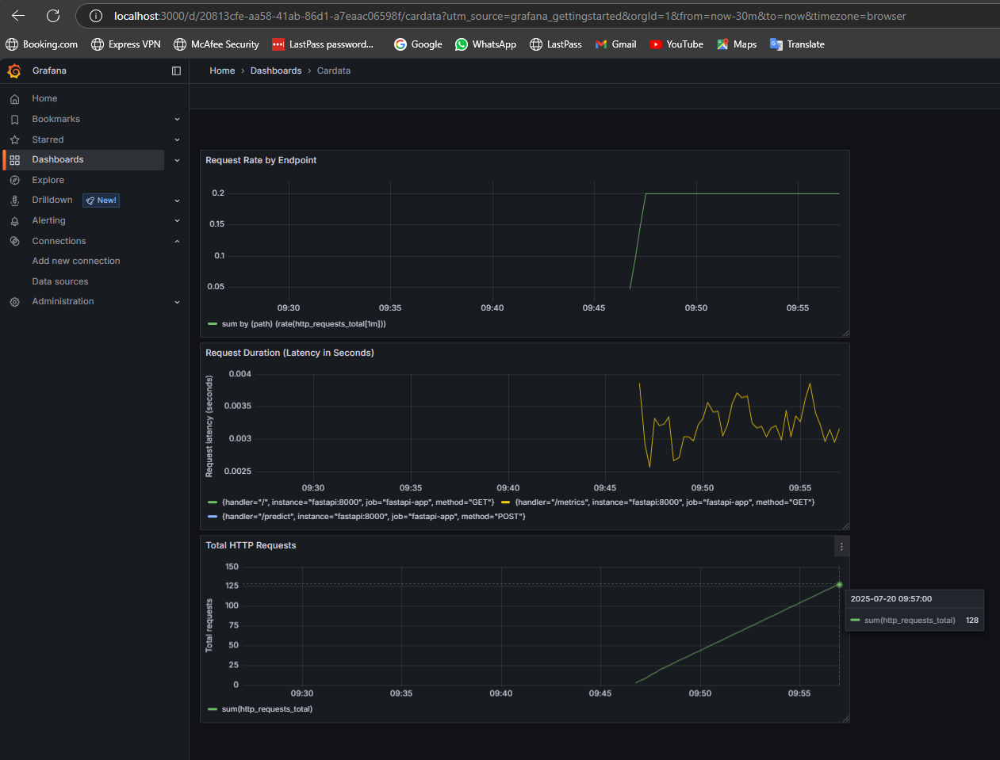

# Used Car Price Prediction — MLOps + DevOps Project

This project demonstrates a complete MLOps + DevOps pipeline for predicting used car prices. It follows modular, version-controlled, and production-grade best practices.

---

## Project Architecture

This architecture represents a full end-to-end MLOps + DevOps pipeline that automates data preparation, model training, version control, containerization, CI/CD, deployment, monitoring, and security. Each component plays a key role in building a reliable and production-ready ML system.

---

### 🔹 1. GitHub Repository (Version Control)

Acts as the central source of truth for all code, configurations, and pipeline definitions.  
Git is used to version all files.  
GitHub hosts the repository, enabling collaboration and CI/CD integration.  
`.gitignore` ensures that large or sensitive files (e.g., datasets, `.env`) are not tracked.

 Screenshot:

---

### 🔹 2. DVC + params.yaml (Data & Parameter Versioning)

- DVC (Data Version Control) tracks:
  - Raw and processed datasets
  - Intermediate artifacts (like preprocessed data or models)
- `params.yaml` stores configurable parameters like:
  - Learning rate
  - Number of estimators
  - Split ratio
- These versions are reproducible and linked to Git commits.

 Screenshot:

---

### 🔹 3. Modular ML Pipeline (Preprocess → Train → Evaluate)

- `preprocess.py`: Cleans and prepares data  
- `train.py`: Trains ML models (e.g., Random Forest)  
- `evaluate.py`: Evaluates model performance using metrics like RMSE, R²  
- DVC is used to chain and track these steps via `dvc.yaml`.

 Screenshot:

---

### 🔹 4. MLflow Tracking

- MLflow logs:
  - Models
  - Metrics (e.g., RMSE, R²)
  - Parameters and artifacts
- Enables easy comparison and reproducibility of different model versions.
- The best model can be registered and used for deployment.

 Screenshot:

---

### 🔹 5. FastAPI Model Serving + Docker

- A FastAPI app exposes the trained model via a REST API (`/predict` endpoint).
- The API code (`main_html.py`) is containerized using Docker, 
- Dockerfile defines the runtime environment.

Screenshot:
  
Screenshot (Docker Build):

---

### 🔹 6. GitHub Actions CI/CD

- Automates:
  - Building Docker image
  - Pushing Docker image to DockerHub
- Defined via `.github/workflows/docker-publish.yml`

Screenshot:

---

### 🔹 7. Deployment (Docker / Docker Compose)

- Model is deployed as a Docker container on local or server.
- Docker Compose can be used for multi-service deployment (e.g., FastAPI + Prometheus).
- Logs requests and responses for auditing.

Screenshot:

---

### 🔹 8. Monitoring & Drift Detection

- Prometheus collects real-time performance and health metrics of the FastAPI app.
- Grafana visualizes metrics in real time.

Screenshot (Prometheus):
  
Screenshot (Grafana):

---

### 🔹 9. DevSecOps (Security & Compliance)

- Trivy scans Docker images for vulnerabilities (OS packages, libraries).
- GitHub Secrets securely stores sensitive information:
  - Docker credentials
  - API tokens

Screenshot:

---

## Limitations & Improvements

### Improvements
- Automate DVC push/pull via CI
- Add cloud-based deployment (e.g., AWS, Azure)

### Limitations
- Deployed only on local Docker
- No cloud-native infra yet

---
